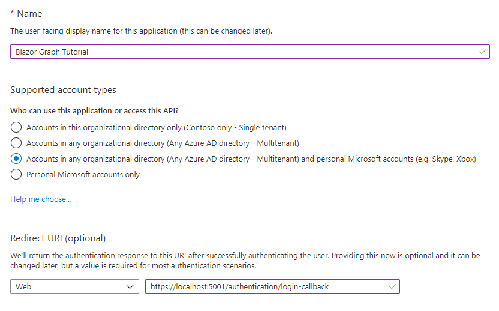
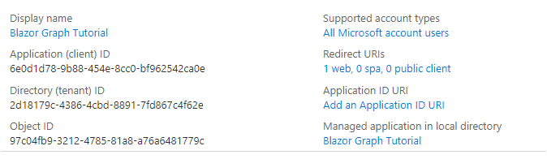

# How to run the completed project

## Prerequisites

To run the completed project in this folder, you need the following:

- The [.NET SDK](https://dotnet.microsoft.com/download) installed on your development machine. (**Note:** This tutorial was written with .NET SDK version 5.0.302. The steps in this guide may work with other versions, but that has not been tested.)
- Either a personal Microsoft account with a mailbox on Outlook.com, or a Microsoft work or school account.

If you don't have a Microsoft account, there are a couple of options to get a free account:

- You can [sign up for a new personal Microsoft account](https://signup.live.com/signup?wa=wsignin1.0&rpsnv=12&ct=1454618383&rver=6.4.6456.0&wp=MBI_SSL_SHARED&wreply=https://mail.live.com/default.aspx&id=64855&cbcxt=mai&bk=1454618383&uiflavor=web&uaid=b213a65b4fdc484382b6622b3ecaa547&mkt=E-US&lc=1033&lic=1).
- You can [sign up for the Office 365 Developer Program](https://developer.microsoft.com/office/dev-program) to get a free Office 365 subscription.

## Register a web application with the Azure Active Directory admin center

1. Open a browser and navigate to the [Azure Active Directory admin center](https://aad.portal.azure.com). Login using a **personal account** (aka: Microsoft Account) or **Work or School Account**.

1. Select **Azure Active Directory** in the left-hand navigation, then select **App registrations** under **Manage**.

    

1. Select **New registration**. On the **Register an application** page, set the values as follows.

    - Set **Name** to `Blazor Graph Tutorial`.
    - Set **Supported account types** to **Accounts in any organizational directory and personal Microsoft accounts**.
    - Under **Redirect URI**, set the first drop-down to **Single-page application (SPA)** and set the value to `https://localhost:5001/authentication/login-callback`.

    

1. Select **Register**. On the **Blazor Graph Tutorial** page, copy the value of the **Application (client) ID** and save it, you will need it in the next step.

    

## Configure the sample

1. Rename the **/GraphTutorial/wwwroot/appsettings.example.json** file to **appsettings.json**.

1. Edit **appsettings.json** and replace `YOUR_APP_ID_HERE` with your application ID.

## Run the sample

In your CLI, run the following command to start the application.

```Shell
dotnet run
```
