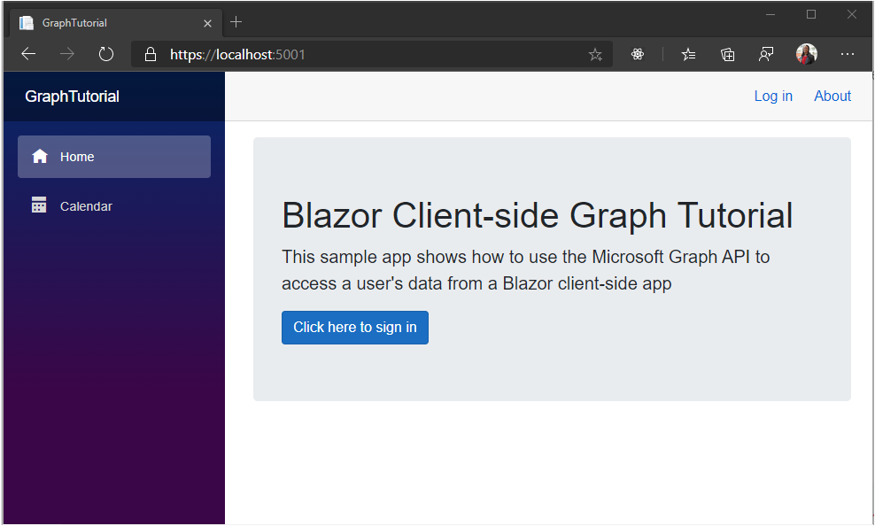

<!-- markdownlint-disable MD002 MD041 -->

Start by creating a Blazor WebAssembly app.

1. Open your command-line interface (CLI) in a directory where you want to create the project. Run the following command.

    ```Shell
    dotnet new blazorwasm --auth SingleOrg -o GraphTutorial
    ```

    The `--auth SingleOrg` parameter causes the generated project to include configuration for authentication with the Microsoft identity platform.

1. Once the project is created, verify that it works by changing the current directory to the **GraphTutorial** directory and running the following command in your CLI.

    ```Shell
    dotnet watch run
    ```

1. Open your browser and browse to `https://localhost:5001`. If everything is working, you should see a "Hello, world!" message.

> [!IMPORTANT]
> If you receive a warning that the certificate for **localhost** is un-trusted you can use the .NET Core CLI to install and trust the development certificate. See [Enforce HTTPS in ASP.NET Core](/aspnet/core/security/enforcing-ssl?view=aspnetcore-3.1) for instructions for specific operating systems.

## Add NuGet packages

Before moving on, install some additional NuGet packages that you will use later.

- [Microsoft.Graph](https://www.nuget.org/packages/Microsoft.Graph/) for making calls to Microsoft Graph.
- [TimeZoneConverter](https://github.com/mj1856/TimeZoneConverter) for translating Windows time zone identifiers to IANA identifiers.

1. Run the following commands in your CLI to install the dependencies.

    ```Shell
    dotnet add package Microsoft.Graph --version 3.18.0
    dotnet add package TimeZoneConverter
    ```

## Design the app

In this section you will create the basic UI structure of the application.

1. Remove sample pages generated by the template. Delete the following files.

    - **./Pages/Counter.razor**
    - **./Pages/FetchData.razor**
    - **./Shared/SurveyPrompt.razor**
    - **./wwwroot/sample-data/weather.json**

1. Open **./wwwroot/index.html** and add the following code just **before** the closing `</body>` tag.

    :::code language="html" source="../demo/GraphTutorial/wwwroot/index.html" id="BootStrapJSSnippet":::

    This adds the [Bootstrap](https://getbootstrap.com/docs/4.5/getting-started/introduction/) javascript files.

1. Open **./wwwroot/css/app.css** and add the following code.

    :::code language="css" source="../demo/GraphTutorial/wwwroot/css/app.css" id="CssSnippet":::

1. Open **./Shared/NavMenu.razor** and replace its contents with the following.

    :::code language="razor" source="../demo/GraphTutorial/Shared/NavMenu.razor" id="NavMenuSnippet":::

1. Open **./Pages/Index.razor** and replace its contents with the following.

    :::code language="razor" source="../demo/GraphTutorial/Pages/Index.razor" id="IndexSnippet":::

1. Open **./Shared/LoginDisplay.razor** and replace its contents with the following.

    ```razor
    @using Microsoft.AspNetCore.Components.Authorization
    @using Microsoft.AspNetCore.Components.WebAssembly.Authentication

    @inject NavigationManager Navigation
    @inject SignOutSessionStateManager SignOutManager

    <AuthorizeView>
        <Authorized>
            <a class="text-decoration-none" data-toggle="dropdown" href="#" role="button">
                
            </a>
            <div class="dropdown-menu dropdown-menu-right">
                <h5 class="dropdown-item-text mb-0">@context.User.Identity.Name</h5>
                <p class="dropdown-item-text text-muted mb-0">placeholder@contoso.com</p>
                <div class="dropdown-divider"></div>
                <button class="dropdown-item" @onclick="BeginLogout">Log out</button>
            </div>
        </Authorized>
        <NotAuthorized>
            <a href="authentication/login">Log in</a>
        </NotAuthorized>
    </AuthorizeView>

    @code{
        private async Task BeginLogout(MouseEventArgs args)
        {
            await SignOutManager.SetSignOutState();
            Navigation.NavigateTo("authentication/logout");
        }
    }
    ```

1. Create a new directory in the **./wwwroot** directory named **img**. Add an image file of your choosing named **no-profile-photo.png** in this directory. This image will be used as the user's photo when the user has no photo in Microsoft Graph.

    > [!TIP]
    > You can download the image used in these screenshots from [GitHub](https://github.com/microsoftgraph/msgraph-training-blazor-clientside/blob/master/demo/GraphTutorial/wwwroot/img/no-profile-photo.png).

1. Save all of your changes and refresh the page.

    
