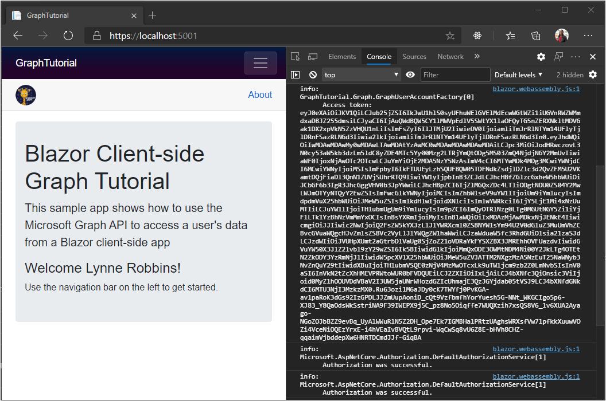
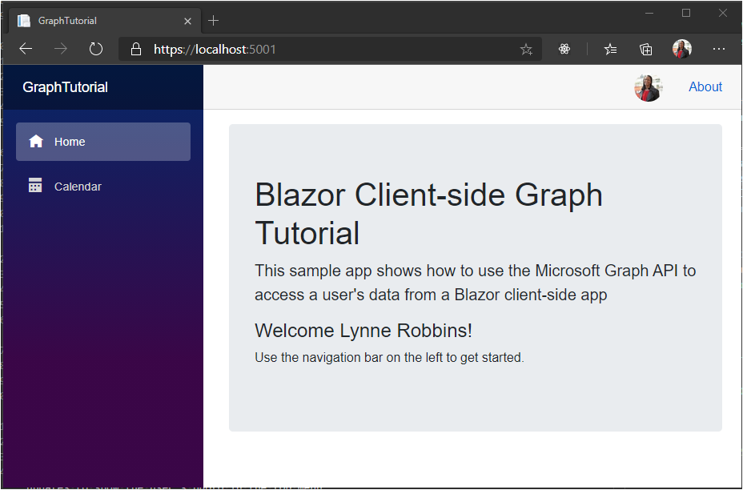
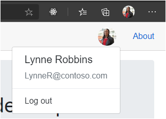

<!-- markdownlint-disable MD002 MD041 -->

In this exercise you will extend the application from the previous exercise to support authentication with Azure AD. This is required to obtain the necessary OAuth access token to call the Microsoft Graph API.

1. Open **./wwwroot/appsettings.json**. Add a `GraphScopes` property and update the `Authority` and `ClientId` values to match the following.

    :::code language="json" source="../demo/GraphTutorial/wwwroot/appsettings.example.json" highlight="3-4,7":::

    Replace `YOUR_APP_ID_HERE` with the application ID from your app registration.

    > [!IMPORTANT]
    > If you're using source control such as git, now would be a good time to exclude the **appsettings.json** file from source control to avoid inadvertently leaking your app ID.

    Review the scopes included in the `GraphScopes` value.

    - **User.Read** allows the application to get the user's profile and photo.
    - **MailboxSettings.Read** allows the application to get mailbox settings, which includes the user's preferred time zone.
    - **Calendars.ReadWrite** allows the application to read and write to the user's calendar.

## Implement sign-in

At this point the .NET Core project template has added the code to enable sign in. However, in this section you'll add additional code to improve the experience by adding information from Microsoft Graph to the user's identity.

1. Open **./Pages/Authentication.razor** and replace its contents with the following.

    :::code language="razor" source="../demo/GraphTutorial/Pages/Authentication.razor" id="AuthenticationSnippet":::

    This replaces the default error message when login fails to display any error message returned by the authentication process.

1. Create a new directory in the root of the project named **Graph**.

1. Create a new file in the **./Graph** directory named **GraphUserAccountFactory.cs** and add the following code.

    ```csharp
    using System.Security.Claims;
    using System.Threading.Tasks;
    using Microsoft.AspNetCore.Components.WebAssembly.Authentication;
    using Microsoft.AspNetCore.Components.WebAssembly.Authentication.Internal;
    using Microsoft.Extensions.Logging;
    using Microsoft.Graph;

    namespace GraphTutorial.Graph
    {
        // Extends the AccountClaimsPrincipalFactory that builds
        // a user identity from the identity token.
        // This class adds additional claims to the user's ClaimPrincipal
        // that hold values from Microsoft Graph
        public class GraphUserAccountFactory
            : AccountClaimsPrincipalFactory<RemoteUserAccount>
        {
            private readonly IAccessTokenProviderAccessor accessor;
            private readonly ILogger<GraphUserAccountFactory> logger;

            public GraphUserAccountFactory(IAccessTokenProviderAccessor accessor,
                ILogger<GraphUserAccountFactory> logger)
            : base(accessor)
            {
                this.accessor = accessor;
                this.logger = logger;
            }

            public async override ValueTask<ClaimsPrincipal> CreateUserAsync(
                RemoteUserAccount account,
                RemoteAuthenticationUserOptions options)
            {
                // Create the base user
                var initialUser = await base.CreateUserAsync(account, options);

                // If authenticated, we can call Microsoft Graph
                if (initialUser.Identity.IsAuthenticated)
                {
                    try
                    {
                        // Add additional info from Graph to the identity
                        await AddGraphInfoToClaims(accessor, initialUser);
                    }
                    catch (AccessTokenNotAvailableException exception)
                    {
                        logger.LogError($"Graph API access token failure: {exception.Message}");
                    }
                    catch (ServiceException exception)
                    {
                        logger.LogError($"Graph API error: {exception.Message}");
                        logger.LogError($"Response body: {exception.RawResponseBody}");
                    }
                }

                return initialUser;
            }

            private async Task AddGraphInfoToClaims(
                IAccessTokenProviderAccessor accessor,
                ClaimsPrincipal claimsPrincipal)
            {
                // TEMPORARY: Get the token and log it
                var result = await accessor.TokenProvider.RequestAccessToken();

                if (result.TryGetToken(out var token))
                {
                    logger.LogInformation($"Access token: {token.Value}");
                }
            }
        }
    }
    ```

    This class extends the **AccountClaimsPrincipalFactory** class and overrides the `CreateUserAsync` method. For now, this method only logs the access token for debugging purposes. You'll implement the Microsoft Graph calls later in this exercise.

1. Open **./Program.cs** and add the following `using` statements at the top of the file.

    ```csharp
    using Microsoft.AspNetCore.Components.WebAssembly.Authentication;
    using GraphTutorial.Graph;
    ```

1. Inside `Main`, replace the existing `builder.Services.AddMsalAuthentication` call with the following.

    :::code language="csharp" source="../demo/GraphTutorial/Program.cs" id="AddMsalAuthSnippet":::

    Consider what this code does.

    - It loads the value of `GraphScopes` from **appsettings.json** and adds each scope to the default scopes used by the MSAL provider.
    - It replaces the existing account factory with the **GraphUserAccountFactory** class.

1. Save your changes and restart the app. Use the **Log in** link to log in. Review and accept the requested permissions.

1. The app refreshes with a welcome message. Access your browser's developer tools and review the **Console** tab. The app logs the access token.

    

## Get user details

Once the user is logged in, you can get their information from Microsoft Graph. In this section you'll use information from Microsoft Graph to add additional claims to the user's **ClaimsPrincipal**.

1. Create a new file in the **./Graph** directory named **GraphClaimsPrincipalExtensions.cs** and add the following code.

    :::code language="csharp" source="../demo/GraphTutorial/Graph/GraphClaimsPrincipalExtensions.cs" id="GraphClaimsExtensionsSnippet":::

    This code implements extension methods for the **ClaimsPrincipal** class that allow you to get and set claims with values from Microsoft Graph objects.

1. Create a new file in the **./Graph** directory named **BlazorAuthProvider.cs** and add the following code.

    :::code language="csharp" source="../demo/GraphTutorial/Graph/BlazorAuthProvider.cs" id="BlazorAuthProviderSnippet":::

    This code implements an authentication provider for the Microsoft Graph SDK that uses the **IAccessTokenProviderAccessor** provided by the **Microsoft.AspNetCore.Components.WebAssembly.Authentication** package to get access tokens.

1. Create a new file in the **./Graph** directory named **GraphClientFactory.cs** and add the following code.

    :::code language="csharp" source="../demo/GraphTutorial/Graph/GraphClientFactory.cs" id="GraphClientFactorySnippet":::

    This class creates a **GraphServiceClient** configured with the **BlazorAuthProvider**.

1. Open **./Program.cs** and change the **BaseAddress** of the new **HttpClient** to `"https://graph.microsoft.com"`.

    :::code language="csharp" source="../demo/GraphTutorial/Program.cs" id="HttpClientSnippet":::

1. Add the following code before the `await builder.Build().RunAsync();` line.

    :::code language="csharp" source="../demo/GraphTutorial/Program.cs" id="AddGraphClientFactorySnippet":::

    This adds the **GraphClientFactory** as a scoped service that we can make available via dependency injection.

1. Open **./Graph/GraphUserAccountFactory.cs** and add the following property to the class.

    ```csharp
    private readonly GraphClientFactory clientFactory;
    ```

1. Update the constructor to take a **GraphClientFactory** parameter and assign it to the `clientFactory` property.

    :::code language="csharp" source="../demo/GraphTutorial/Graph/GraphUserAccountFactory.cs" id="ConstructorSnippet" highlight="2,7":::

1. Replace the existing `AddGraphInfoToClaims` function with the following.

    :::code language="csharp" source="../demo/GraphTutorial/Graph/GraphUserAccountFactory.cs" id="AddGraphInfoToClaimsSnippet":::

    Consider what this code does.

    - It [gets the user's profile](https://docs.microsoft.com/graph/api/user-get).
        - It uses `Select` to limit which properties are returned.
    - It [gets the user's photo](https://docs.microsoft.com/graph/api/profilephoto-get).
        - It requests specifically the 48x48 pixel version of the user's photo.
    - It adds the information to the **ClaimsPrincipal**.

1. Open **./Shared/LoginDisplay.razor** and make the following changes.

    - Replace `/img/no-profile-photo.png` with `@(context.User.GetUserGraphPhoto() ?? "/img/no-profile-photo.png")`.
    - Replace `placeholder@contoso.com` with `@context.User.GetUserGraphEmail()`.

    ```razor
    ...
    

    ...

    <p class="dropdown-item-text text-muted mb-0">@context.User.GetUserGraphEmail()</p>
    ...
    ```

1. Save all of your changes and restart the app. Log into the app. The app updates to show the user's photo in the top menu. Selecting the user's photo opens a drop-down menu with the user's name, email address, and a **Log out** button.

    

    
