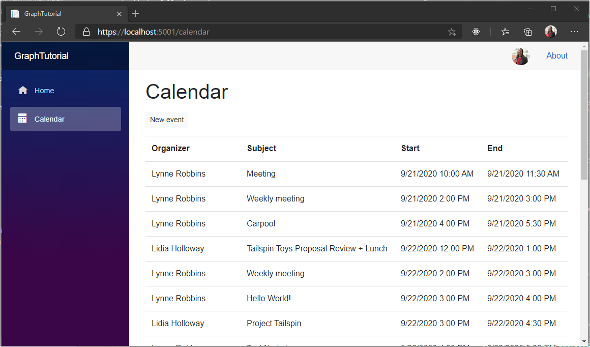

<!-- markdownlint-disable MD002 MD041 -->

In this section you will further incorporate Microsoft Graph into the application to get a view of the user's calendar for the current week.

## Get a calendar view

1. Create a new file in the **./Pages** directory named **Calendar.razor** and add the following code.

    ```razor
    @page "/calendar"
    @using Microsoft.Graph
    @using TimeZoneConverter

    @inject GraphTutorial.Graph.GraphClientFactory clientFactory

    <AuthorizeView>
        <Authorized>
            <!-- Temporary JSON dump of events -->
            <code>@graphClient.HttpProvider.Serializer.SerializeObject(events)</code>
        </Authorized>
        <NotAuthorized>
            <RedirectToLogin />
        </NotAuthorized>
    </AuthorizeView>

    @code{
        [CascadingParameter]
        private Task<AuthenticationState> authenticationStateTask { get; set; }

        private GraphServiceClient graphClient;
        private IList<Event> events = new List<Event>();
        private string dateTimeFormat;
    }
    ```

1. Add the following code inside the `@code{}` section.

    :::code language="razor" source="../demo/GraphTutorial/Pages/Calendar.razor" id="GetEventsSnippet":::

    Consider what this code does.

    - It gets the current user's time zone, date format, and time format from the custom claims added to the user.
    - It calculates the start and end of the current week in the user's preferred time zone.
    - It gets a calendar view from Microsoft Graph for the current week.
        - It includes the `Prefer: outlook.timezone` header to cause Microsoft Graph to return the `start` and `end` properties in the specified time zone.
        - It uses `Top(50)` to request up to 50 events in the response.
        - It uses `Select(u => new {})` to request just the properties used by the app.
        - It uses `OrderBy("start/dateTime")` to sort the results by start time.

1. Save all of your changes and restart the app. Choose the **Calendar** nav item. The app displays a JSON representation of the events returned from Microsoft Graph.

## Display the results

Now you can replace the JSON dump with something more user-friendly.

1. Add the following function inside the `@code{}` section.

    :::code language="csharp" source="../demo/GraphTutorial/Pages/Calendar.razor" id="FormatDateSnippet":::

    This code takes an ISO 8601 date string and converts it into the user's preferred date and time format.

1. Replace the `<code>` element inside the `<Authorized>` element with the following.

    :::code language="razor" source="../demo/GraphTutorial/Pages/Calendar.razor" id="CalendarViewSnippet":::

    This creates a table of the events returned by Microsoft Graph.

1. Save your changes and restart the app. Now the **Calendar** page renders a table of events.

    
