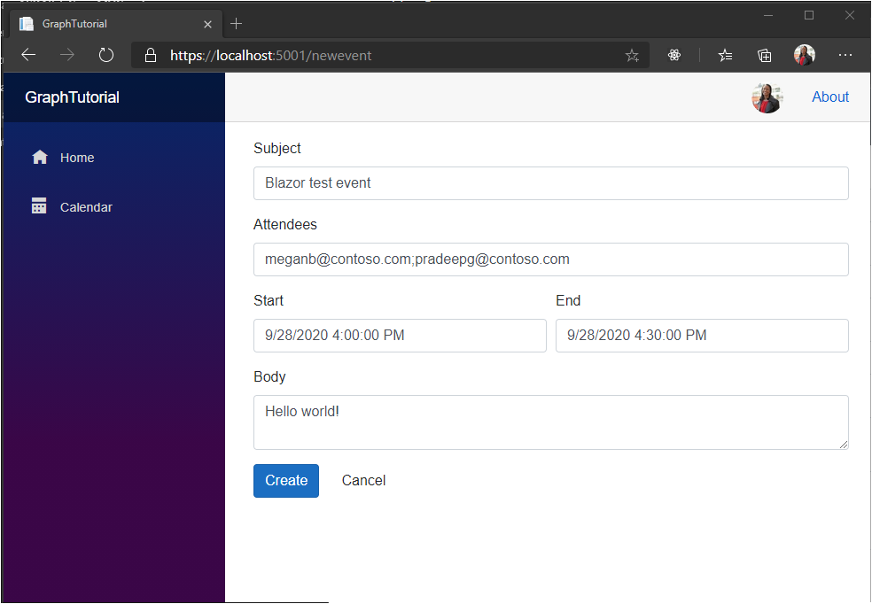

<!-- markdownlint-disable MD002 MD041 -->

In this section you will add the ability to create events on the user's calendar.

1. Create a new file in the **./Pages** directory named **NewEvent.razor** and add the following code.

    :::code language="razor" source="../demo/GraphTutorial/Pages/NewEvent.razor" id="NewEventFormSnippet":::

    This adds a form to the page so the user can enter values for the new event.

1. Add the following code to the end of the file.

    :::code language="razor" source="../demo/GraphTutorial/Pages/NewEvent.razor" id="NewEventCodeSnippet":::

    Consider what this code does.

    - In `OnInitializedAsync` it gets the authenticated user's time zone.
    - In `CreateEvent` it initializes a new **Event** object using the values from the form.
    - It uses the Graph SDK to add the event to the user's calendar.

1. Save all of your changes and restart the app. On the **Calendar** page, select **New event**. Fill in the form and choose **Create**.

    
